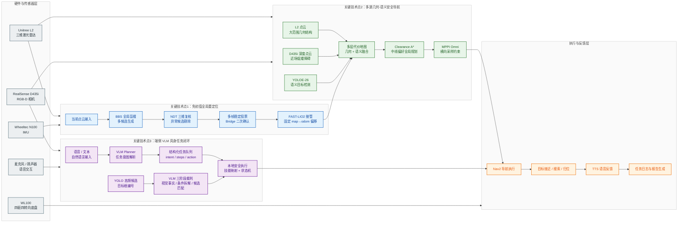

# 基于多源光感知与端侧 VLM 协同的移动机器人系统

本仓库用于展示第二十一届中国研究生电子设计竞赛作品中的关键技术点源码与算法改进链路。当前整理内容包括**关键技术点1：免初值全局重定位**、**关键技术点2：多源几何-语义安全导航**和**关键技术点3：端侧 VLM 驱动的自然语言具身任务规划与安全执行**。

## 关键技术点

| 序号 | 技术点 | 核心链路 | 入口 |
|---|---|---|---|
| 1 | 免初值全局重定位 | BBS 全局搜索 + NDT 三维复核 + 多帧稳定投票 + FAST-LIO2 固定偏移接管 | [`关键技术点1_免初值全局重定位/`](./关键技术点1_免初值全局重定位/) |
| 2 | 多源几何-语义安全导航 | L2 / D435i 几何融合 + YOLOE-26 语义代价地图 + Clearance A* + MPPI 横向约束 | [`关键技术点2_多源几何语义安全导航/`](./关键技术点2_多源几何语义安全导航/) |
| 3 | 端侧 VLM 驱动的自然语言具身任务规划与安全执行 | 自然语言解析 + YOLO 候选生成 + VLM 语义裁判 + 本地安全执行 + 任务报告闭环 | [`关键技术点3_端侧VLM驱动的自然语言具身任务规划与安全执行/`](./关键技术点3_端侧VLM驱动的自然语言具身任务规划与安全执行/) |

## 系统链路概览

本系统不是三个孤立算法模块的简单拼接，而是围绕真实移动机器人任务形成一条端侧闭环：先解决机器人任意位置启动后的全局位姿接入，再将多源光感知结果转化为安全导航代价，最后把自然语言任务和开放语义目标判断接入可验证、可中断的机器人执行链路。

## 三个技术点之间的关系

| 层级 | 解决的问题 | 输出给下一层的能力 |
|---|---|---|
| 定位层 | 机器人在任意位置启动后缺少全局位姿 | 稳定的 `map -> odom` 对齐关系和可用于导航的全局位姿 |
| 感知导航层 | 单一传感器难以同时覆盖低矮障碍、语义目标和通道安全裕度 | 融合几何与语义风险的代价地图、安全居中的全局路径和稳定局部控制 |
| 具身任务层 | 自然语言和开放语义目标难以直接落地为机器人动作 | 结构化任务、候选目标裁判结果、可执行动作和任务反馈记录 |

## 评委阅读路径

| 阅读目标 | 建议入口 | 重点查看 |
|---|---|---|
| 看定位算法改进 | [`关键技术点1_免初值全局重定位/`](./关键技术点1_免初值全局重定位/) | BBS 多候选、NDT 复核、多帧稳定投票、FAST-LIO2 固定偏移接管 |
| 看感知导航安全性 | [`关键技术点2_多源几何语义安全导航/`](./关键技术点2_多源几何语义安全导航/) | L2 / D435i / YOLOE 融合、Clearance A*、MPPI 横向约束 |
| 看 VLM 如何落地到机器人任务 | [`关键技术点3_端侧VLM驱动的自然语言具身任务规划与安全执行/`](./关键技术点3_端侧VLM驱动的自然语言具身任务规划与安全执行/) | VLM Planner、YOLO 候选编号、三阶段语义裁判、本地安全执行 |
