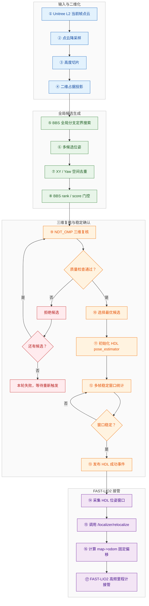

# 关键技术点1：免初值全局重定位

## 技术目标

本技术点面向机器人定位丢失后的全局恢复问题。目标是在不人工输入初始位姿的情况下，根据当前三维激光点云和已构建的全局点云地图，自动估计机器人在 `map` 坐标系下的位姿，并将确认后的位姿交给 FAST-LIO2 定位链路继续输出稳定的全局定位结果。

> **边界说明**
> 本文中的“免初值”并不表示系统不需要地图或传感器标定。该方法的前提条件包括：全局点云地图已加载，实时三维激光点云可用，雷达与机器人坐标系关系正确，ROS TF 坐标树配置一致。

## 链路概览

| 阶段 | 作用 | 关键源码 |
|---|---|---|
| BBS 全局搜索 | 在无人工初值条件下生成全局候选位姿 | `global_localization_bbs.cpp`、`bbs_localization.cpp` |
| 多候选去重 | 保留空间分布不同的候选，降低重复结构误匹配风险 | `global_localization_bbs.cpp` |
| NDT 三维复核 | 用三维点云配准复核二维搜索候选 | `hdl_localization_nodelet.cpp` |
| 多帧稳定投票 | 避免单帧误匹配直接接管定位 | `hdl_localization_nodelet.cpp` |
| FAST-LIO2 接管 | 写入 `map->odom` 固定偏移，由 FAST-LIO2 继续输出高频里程计 | `hdl_to_localizer_bridge.py`、`localizer_node.cpp` |

## 总体流程

## 核心改进

1. 将单候选 BBS 搜索扩展为多候选全局搜索，避免只依赖一个二维匹配最优解。
2. 增加 XY / Yaw 空间去重，使候选覆盖不同空间区域，降低候选集中在同一局部极值附近的风险。
3. 使用 NDT_OMP 对 BBS 候选进行三维点云复核，弥补二维占据投影对高度结构利用不足的问题。
4. 结合 NDT 收敛状态、fitness score、位姿修正量和 inlier ratio 对候选进行质量评价。
5. 增加多帧稳定投票，只有连续窗口内位姿统计稳定时才发布重定位成功事件。
6. 将最终确认的全局位姿写入 FAST-LIO2 localizer 的 `map->odom` 固定偏移，避免持续 ICP / NDT 对 TF 的高频修正。

## 目录说明

| 路径 | 内容 |
|---|---|
| [`docs/01_算法链路说明.md`](./docs/01_算法链路说明.md) | 免初值全局重定位的完整算法链路 |
| [`docs/02_关键源码索引.md`](./docs/02_关键源码索引.md) | 关键源码文件与算法环节的对应关系 |
| [`src/`](./src/) | 本技术点对应的核心源码文件 |
