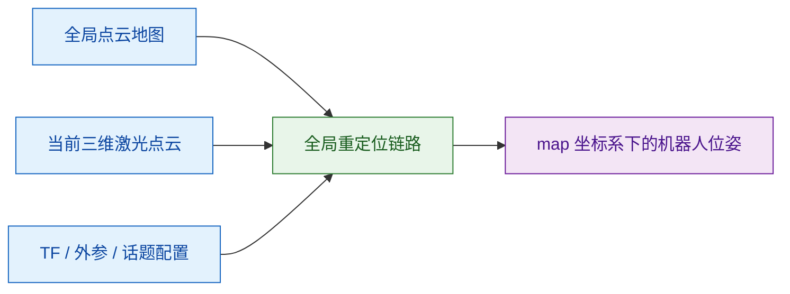
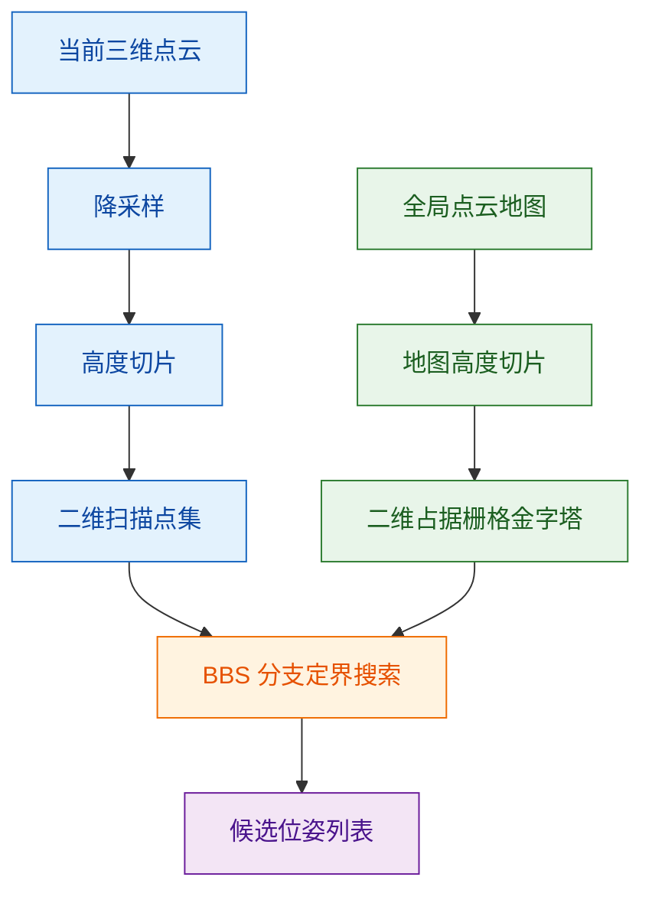
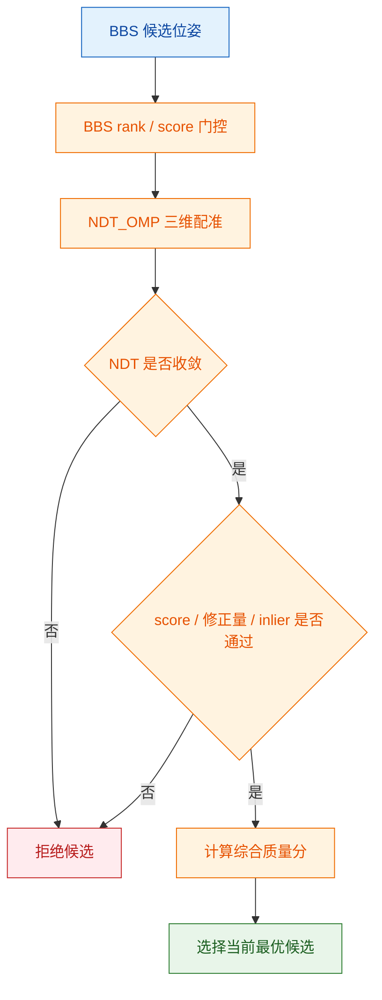
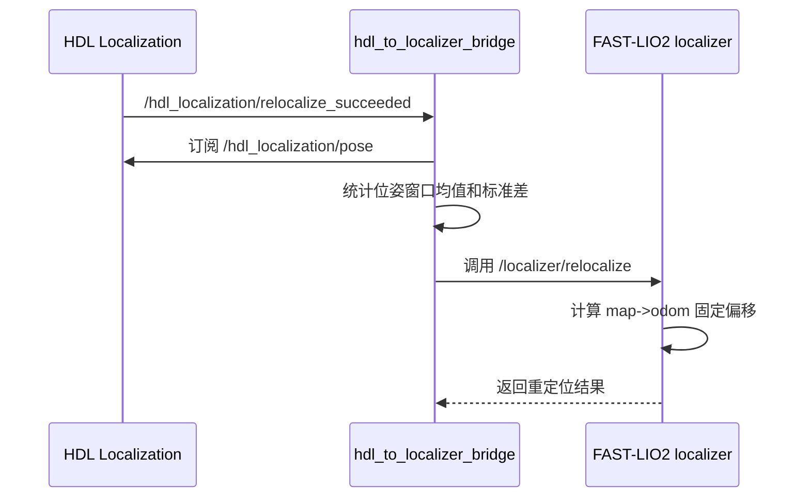

# 算法链路说明

## 1. 输入与前提

本链路的输入包括当前三维激光点云、已构建的全局点云地图、ROS TF 坐标关系以及 FAST-LIO2 输出的局部里程计。算法不要求人工提供初始位姿，但要求地图、点云话题、传感器外参和坐标系配置正确。

## 2. BBS 全局搜索

系统首先对当前点云进行降采样，并按指定高度范围切片。切片后的点云被投影到二维平面，与全局地图的二维占据栅格进行匹配。BBS 使用分支定界策略在全局平移和航向角搜索空间内查找候选位姿。

该阶段的作用是提供免人工初值的全局候选。由于二维投影会损失部分三维结构信息，因此 BBS 结果不直接作为最终定位结果接管系统。

## 3. 多候选生成与空间去重

长廊、货架、温室通道等环境中常见重复结构，单个最高分候选可能落在相似区域。为降低该风险，系统保留多个 BBS 候选，并使用 XY 距离和 Yaw 角度阈值进行空间去重。

| 机制 | 目的 |
|---|---|
| 多候选返回 | 保留多个可能全局位姿，不把决策压缩到单个二维最优解 |
| XY 去重 | 避免多个候选集中在同一局部平移区域 |
| Yaw 去重 | 避免多个候选仅在角度上高度相似 |
| 分桶候选 | 尽量覆盖多个空间区域，提高后续复核机会 |

## 4. NDT_OMP 三维复核

BBS 只完成二维占据层面的粗定位。系统将通过 BBS rank / score 门控的候选送入 NDT_OMP，以候选位姿作为初始变换，对当前三维点云和全局地图进行配准复核。

每个候选会检查以下指标：

| 指标 | 含义 |
|---|---|
| NDT 收敛状态 | 判断三维配准是否形成有效优化结果 |
| fitness score | 判断点云配准残差是否满足阈值 |
| XY 修正量 | 判断 NDT 是否大幅拉动 BBS 候选位置 |
| Yaw 修正量 | 判断 NDT 是否大幅拉动 BBS 候选航向 |
| inlier ratio | 判断当前点云与地图的有效重叠比例 |
| 综合质量分 | 在多个通过候选中选择更稳定的结果 |

## 5. 多帧稳定投票

通过 NDT 复核的候选仍不立即接管定位。系统先用该候选初始化 HDL 的位姿估计器，并在后续点云帧中维护位姿滑动窗口。只有当窗口内的位置标准差、航向角标准差和均值漂移满足阈值时，才认为本次重定位稳定。

该设计用于降低单帧误匹配、局部相似结构和瞬时点云质量波动造成的错误接管风险。

## 6. HDL 到 FAST-LIO2 的桥接

HDL 稳定确认后发布成功事件。桥接节点收到事件后，并不立即转发单帧位姿，而是继续采集 HDL 输出的位姿窗口，对窗口均值和标准差进行检查。窗口稳定后，桥接节点调用 FAST-LIO2 localizer 的 `/localizer/relocalize` 服务。

## 7. FAST-LIO2 固定偏移接管

FAST-LIO2 localizer 接收全局位姿后，根据当前 FAST-LIO2 局部里程计位姿计算 `map->odom` 固定偏移。配置中关闭持续 ICP TF 更新后，后续定位主要由 FAST-LIO2 高频里程计维持，重定位模块只负责恢复全局一致性。

这种设计将全局重定位与高频里程计输出分离：BBS 和 NDT 负责低频、必要时触发的全局恢复；FAST-LIO2 负责重定位成功后的连续运动估计。
