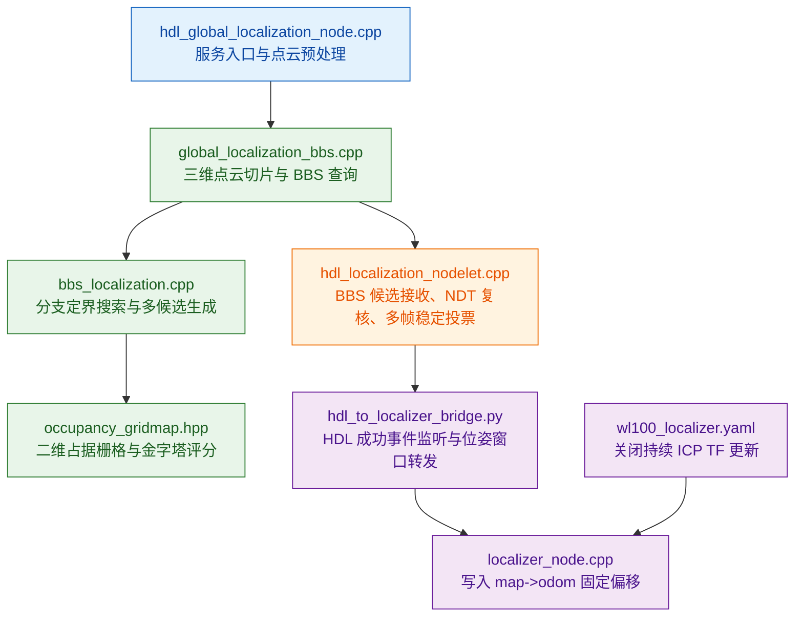

# 关键源码索引

本文档说明关键源码文件与“免初值全局重定位”链路之间的对应关系。源码位于本目录的 [`src/`](../src/) 下。

## 源码链路总览

## 文件到算法阶段

| 文件 | 所属阶段 | 主要作用 |
|---|---|---|
| `src/hdl_global_localization_node.cpp` | 服务入口 | 接收查询请求，完成点云转换、降采样和候选结果封装 |
| `src/global_localization_bbs.cpp` | BBS 搜索引擎 | 完成点云切片、多候选调用、候选去重和诊断输出 |
| `src/bbs_localization.cpp` | BBS 核心 | 实现分支定界搜索、多候选搜索和分布式候选保留 |
| `src/occupancy_gridmap.hpp` | 地图评分 | 构建二维占据栅格金字塔并提供匹配评分 |
| `src/hdl_localization_nodelet.cpp` | NDT 复核与稳定投票 | 对 BBS 候选进行三维复核、质量筛选和多帧稳定确认 |
| `src/hdl_to_localizer_bridge.py` | 桥接转发 | 监听 HDL 成功事件，采集稳定位姿并调用 localizer |
| `src/localizer_node.cpp` | FAST-LIO2 接管 | 接收全局位姿，写入 `map->odom` 固定偏移 |
| `src/wl100_localizer.yaml` | 参数配置 | 关闭持续 ICP TF 更新并配置点云、里程计和配准参数 |

## BBS 全局搜索入口

- `src/hdl_global_localization_node.cpp`
  - 提供 `/hdl_global_localization/query` 服务入口。
  - 将 ROS 点云消息转换为 PCL 点云并进行降采样。
  - 调用全局定位引擎，返回候选位姿、候选分数和相关匹配信息。

## BBS 搜索引擎

- `src/global_localization_bbs.cpp`
  - 将三维点云按高度范围切片为二维点集。
  - 构建地图切片和扫描切片，用于 BBS 二维搜索。
  - 根据参数决定使用普通多候选搜索或分布式多候选搜索。
  - 对原始候选进行 XY / Yaw 去重，输出指定数量的候选位姿。

## BBS 分支定界核心

- `src/bbs_localization.cpp`
  - 构建离散平移和航向角搜索空间。
  - 使用占据栅格金字塔进行由粗到细的分支定界搜索。
  - `localize_n()` 返回得分最高的多个候选。
  - `localize_n_distributed()` 按空间分桶保留候选，降低候选集中在单一区域的概率。

## 占据栅格金字塔

- `src/occupancy_gridmap.hpp`
  - 根据地图切片点构建二维占据栅格。
  - 通过 `pyramid_up()` 生成多分辨率金字塔。
  - 通过 `calc_score()` 为不同离散位姿下的扫描点集计算匹配得分。

## NDT 复核与稳定投票

- `src/hdl_localization_nodelet.cpp`
  - 调用 `/hdl_global_localization/query` 获取 BBS 候选。
  - 使用 BBS rank / score 对候选做第一层门控。
  - 对候选执行 NDT_OMP 三维复核。
  - 根据收敛状态、fitness score、XY / Yaw 修正量和 inlier ratio 筛选候选。
  - 对通过复核的候选执行多帧稳定窗口统计，稳定后发布重定位成功事件。

## HDL 到 FAST-LIO2 的桥接

- `src/hdl_to_localizer_bridge.py`
  - 触发 HDL 的 `/relocalize` 服务。
  - 监听 `/hdl_localization/relocalize_succeeded` 成功事件。
  - 采集 `/hdl_localization/pose` 位姿窗口，并检查位置和航向稳定性。
  - 调用 `/localizer/relocalize` 将稳定后的全局位姿发送给 FAST-LIO2 localizer。

## FAST-LIO2 固定偏移接管

- `src/localizer_node.cpp`
  - 接收桥接节点发送的全局重定位位姿。
  - 根据当前 FAST-LIO2 局部里程计位姿计算 `map->odom` 偏移。
  - 在关闭持续 ICP TF 更新时，直接写入固定偏移，并由 FAST-LIO2 高频里程计维持后续运动估计。

## 配置文件

- `src/wl100_localizer.yaml`
  - 指定 FAST-LIO2 点云和里程计话题。
  - 设置 `map_frame`、`local_frame` 和匹配参数。
  - 通过 `enable_continuous_icp_tf_update: false` 关闭持续 ICP 对 `map->odom` 的修正。
