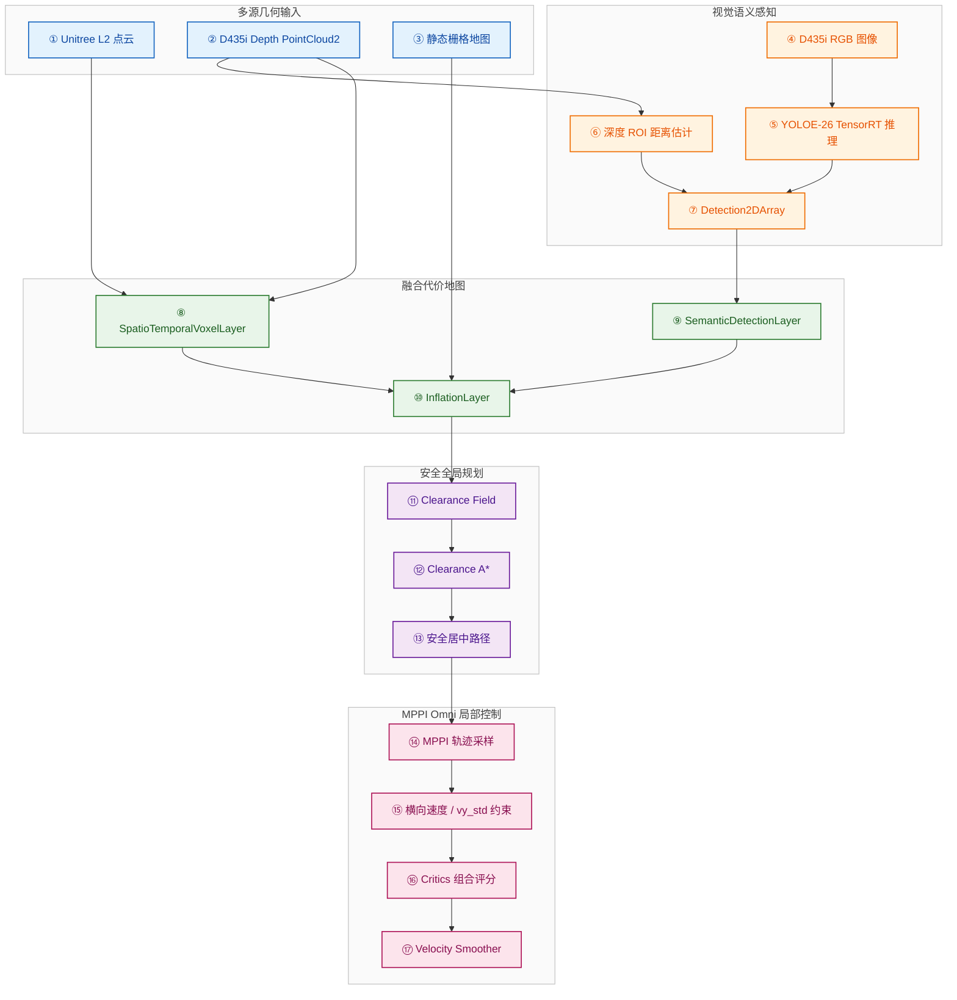

# 关键技术点2：多源几何-语义安全导航

## 技术目标

本技术点面向移动机器人在窄通道、低矮障碍物、动态目标和复杂局部环境中的安全导航问题。系统将 Unitree L2 三维激光雷达和 Intel RealSense D435i RGB-D 相机形成的几何感知，与 YOLOE-26 TensorRT 语义检测结果融合到 Nav2 代价地图中，并结合 Clearance A* 全局规划和 MPPI Omni 横向约束，实现兼顾障碍物安全距离、语义目标规避和全向底盘稳定控制的导航链路。

> **边界说明**
> 本技术点关注“感知信息如何进入导航决策”和“规划控制如何约束安全运动”。其中 VLM 任务理解、自然语言解析和任务编排属于后续关键技术点，不混入本目录；本目录只保留几何感知、语义代价地图、安全规划、MPPI 横向约束和 Nav2 集成相关源码。

## 链路概览

| 层级 | 输入 | 输出 | 核心源码 |
|---|---|---|---|
| 几何感知 | Unitree L2 点云、D435i 深度点云、静态地图 | 体素障碍物与膨胀代价 | `nav2_params.yaml` |
| 语义感知 | D435i RGB、D435i aligned depth | YOLO 检测框、类别、距离 | `yolo_trt_node.cpp` |
| 语义代价地图 | 检测结果、深度距离、TF | Nav2 costmap 语义障碍物 | `semantic_detection_layer.cpp` |
| 安全全局规划 | 全局 costmap | 更远离障碍的全局路径 | `clearance_a_star_planner.cpp` |
| 局部控制 | 全局路径、局部 costmap、机器人状态 | 平滑速度指令 | `nav2_params.yaml`、`dynamic_vy_std_guard.py` |

## 总体流程

## 核心改进

1. 使用 D435i RGB-D 与 Unitree L2 点云共同参与 Nav2 代价地图构建，弥补单一传感器对低矮、近距离或语义目标感知不足的问题。
2. 使用 YOLOE-26 TensorRT C++ 节点在 Jetson Orin NX 上进行实时语义检测，并结合深度 ROI 估计目标距离。
3. 设计 SemanticDetectionLayer，将语义检测目标投影到 Nav2 costmap，使视觉识别到的目标能够直接影响导航避障。
4. 使用 SpatioTemporalVoxelLayer 融合 L2 点云和 D435i 点云，并通过时间衰减机制降低动态障碍残影。
5. 设计 Clearance A* 全局规划器，根据障碍物距离场对贴墙、贴障路径施加代价惩罚，使路径更倾向于通道中部。
6. 在 MPPI Omni 局部控制中约束横向采样强度，通过 `vy_std` 和动态调节脚本减少全向底盘横向抖动，同时保留近目标微调能力。

## 目录说明

| 路径 | 内容 |
|---|---|
| [`docs/01_算法链路说明.md`](./docs/01_算法链路说明.md) | 多源几何-语义安全导航完整链路 |
| [`docs/02_关键源码索引.md`](./docs/02_关键源码索引.md) | 关键源码文件与算法环节对应关系 |
| [`src/`](./src/) | 本技术点对应的核心源码、插件配置和启动文件 |
