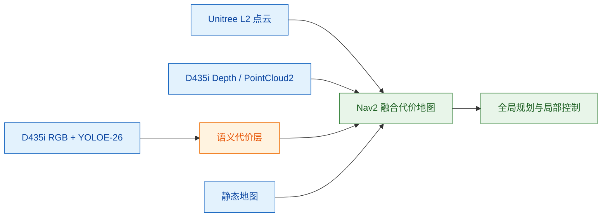
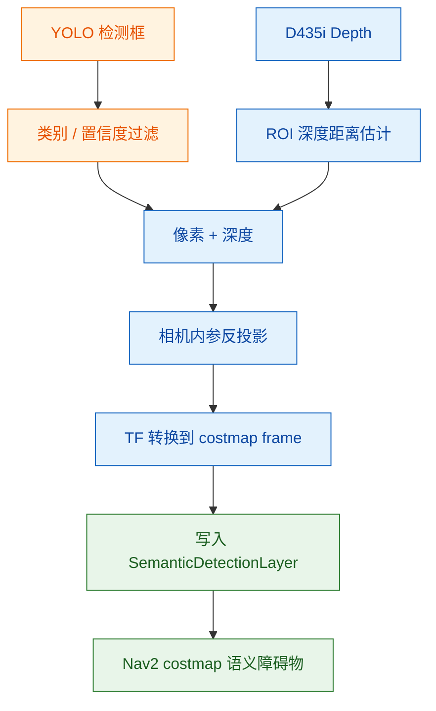
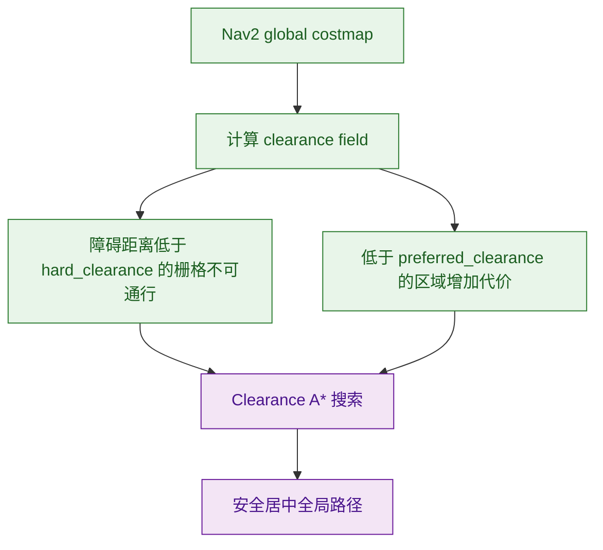

# 算法链路说明

## 1. 输入与前提

本链路的输入包括 Unitree L2 三维点云、D435i RGB 图像、D435i 深度图 / 点云、静态栅格地图、机器人 TF 坐标树和 Nav2 当前导航状态。算法假设相机内参、雷达外参、机器人 footprint 和 `map / odom / base_link / camera_color_optical_frame` 等坐标关系已正确配置。

## 2. YOLOE-26 TensorRT 实时检测

`wl100_perception_cpp` 使用 D435i RGB 图像和 aligned depth 图像作为输入。节点通过 message_filters 对 RGB 与深度帧进行近似时间同步，随后使用 TensorRT 引擎执行 YOLOE-26 推理。检测结果经过置信度过滤和类别白名单过滤后，结合检测框中心区域的深度值估计目标距离，并发布为 `vision_msgs/msg/Detection2DArray`。

该节点的目标不是直接控制机器人，而是以低延迟形式提供“类别 + 检测框 + 深度距离”的语义观测，为后续 costmap 层使用。

## 3. 语义目标到代价地图投影

`SemanticDetectionLayer` 订阅 `/yolo/detections`。对每个检测目标，系统使用检测框中心像素、深度距离和 D435i 相机内参进行三维反投影，再通过 TF 将相机坐标系下的目标点转换到 Nav2 costmap 的全局坐标系。

投影后的语义目标会按类别写入不同半径和代价值，并带有时间衰减。这样视觉检测到的低矮障碍物、动态目标或语义目标能够进入 Nav2 代价地图，参与全局规划和局部避障。

## 4. 几何点云融合代价地图

Nav2 的局部和全局 costmap 中均使用 SpatioTemporalVoxelLayer 融合 Unitree L2 点云和 D435i 点云。L2 点云负责较远距离和主体障碍物感知，D435i 深度点云用于补充近距离、低矮和局部结构信息。体素层配置时间衰减，避免动态障碍长期残留。

同时，语义检测层、静态地图层、膨胀层共同构成最终的可通行代价场。几何层解决“哪里有障碍物”，语义层补充“识别到的目标是否需要更高代价或更大安全半径”。

## 5. Clearance A* 安全居中规划

`ClearanceAStarPlanner` 是自定义 Nav2 全局规划器。它首先在 costmap 上计算每个可通行栅格到最近障碍物的距离场，即 clearance field。随后在 A* 搜索的代价函数中加入 clearance penalty，使靠近障碍物或墙体的路径代价更高。

该规划器不是简单寻找最短路径，而是在可通行、安全距离和路径长度之间折中，使全局路径更倾向于走在通道中部，减少贴墙和贴障风险。

## 6. MPPI Omni 横向约束局部控制

局部控制使用 Nav2 的 `nav2_mppi_controller::MPPIController`，运动模型设置为 `Omni`，以匹配 WL100 四驱四转向底盘的全向运动能力。系统允许 `vx / vy / wz` 三自由度采样，但对横向速度和横向采样强度进行严格约束。

核心约束包括：

| 参数或模块 | 作用 |
|---|---|
| `motion_model: "Omni"` | 允许全向底盘进行前后、横向和旋转控制 |
| `vy_max: 0.2` | 限制最大横向速度 |
| `vy_std: 0.02` | 降低横向采样扰动，减少局部控制横向抖动 |
| `ConstraintCritic` | 惩罚不满足运动约束的候选轨迹 |
| `PathAlignCritic` | 约束局部轨迹贴合全局路径 |
| `PathFollowCritic` | 推动机器人沿全局路径向前推进 |
| `dynamic_vy_std_guard.py` | 根据剩余距离动态调整 `FollowPath.vy_std` |

`dynamic_vy_std_guard.py` 在导航默认阶段保持较小横向采样标准差，接近目标时略微放宽 `vy_std`，使机器人具备近目标微调能力；导航结束或失败后恢复默认值。

## 7. 速度平滑与底盘输出

MPPI 输出的 `cmd_vel_nav` 经过 `velocity_smoother` 平滑后发布到底盘控制话题。速度平滑器再次限制 `vx / vy / wz` 的最大速度和加速度，使局部控制输出满足 WL100 底盘的安全运动边界。
