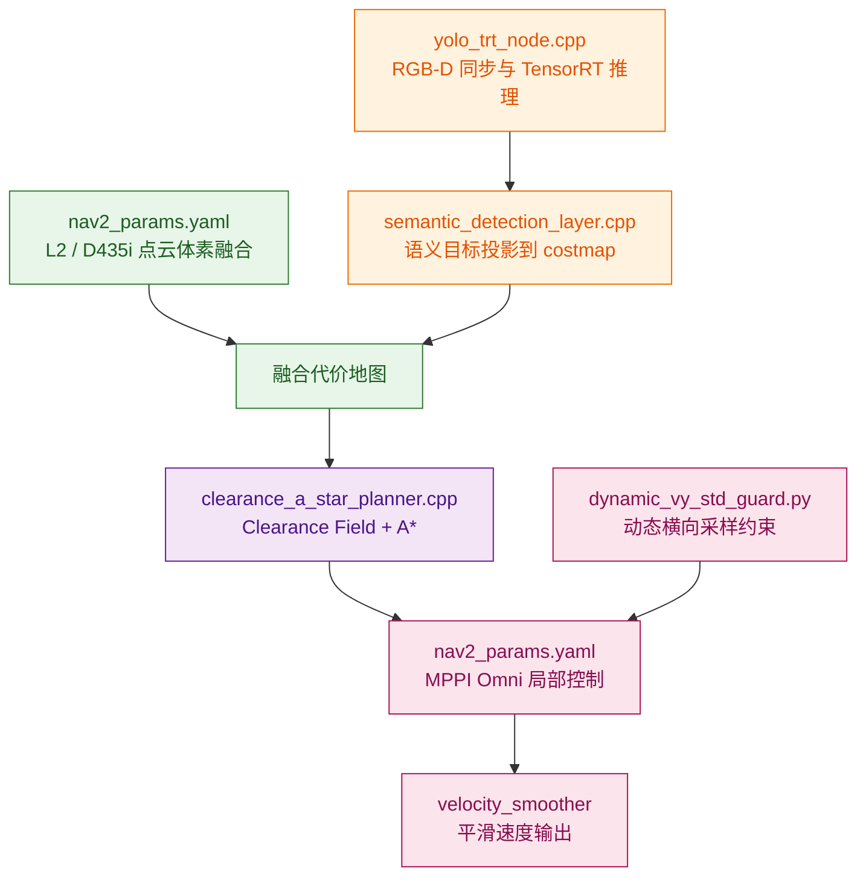

# 关键源码索引

本文档说明关键源码文件与“多源几何-语义安全导航”链路之间的对应关系。源码位于本目录的 [`src/`](../src/) 下。

## 源码链路总览

## 文件到算法阶段

| 文件 | 所属环节 | 主要作用 |
|---|---|---|
| `src/yolo_trt_node.cpp` | 视觉语义感知 | TensorRT 推理、深度距离估计、发布检测结果和标注图 |
| `src/yolo_trt_node.hpp` | 视觉语义感知 | YOLOE-26 节点类、检测结构体、推理接口定义 |
| `src/perception_params.yaml` | 视觉语义感知 | 配置模型路径、类别、推理频率、RGB-D 话题 |
| `src/perception_cpp.launch.py` | 视觉语义感知 | 启动 D435i 和 YOLO TensorRT 节点 |
| `src/semantic_detection_layer.cpp` | 语义代价地图 | 将检测框、深度距离和 TF 转换为 Nav2 costmap 障碍物 |
| `src/semantic_detection_layer.hpp` | 语义代价地图 | 自定义 Costmap Layer 类定义、语义障碍物缓存和 VLM override 接口定义 |
| `src/semantic_costmap_plugins.xml` | 语义代价地图 | 注册 Nav2 Costmap Layer 插件 |
| `src/clearance_a_star_planner.cpp` | 安全全局规划 | 计算 clearance field，执行 Clearance A* 搜索并生成路径 |
| `src/clearance_a_star_planner.hpp` | 安全全局规划 | 自定义 Nav2 GlobalPlanner 接口定义 |
| `src/clearance_planner_plugins.xml` | 安全全局规划 | 注册 Nav2 GlobalPlanner 插件 |
| `src/nav2_params_clearance.yaml` | 安全全局规划 | 配置 Clearance A* 的安全距离和代价权重 |
| `src/navigation_clearance.launch.py` | 安全全局规划 | 启动使用 Clearance A* 的 Nav2 导航链路 |
| `src/nav2_params.yaml` | Nav2 融合配置 | 配置多源 costmap、MPPI、速度平滑和横向约束 |
| `src/nav2_bt.xml` | Nav2 行为树 | 配置 Nav2 导航行为树 |
| `src/navigation.launch.py` | 系统启动 | 启动 Nav2 map_server、planner、controller、BT navigator 等 |
| `src/robot.launch.py` | 系统启动 | 启动底盘、雷达、机器人描述和可选 D435i |
| `src/dynamic_vy_std_guard.py` | MPPI 横向约束 | 根据导航阶段动态调整 `FollowPath.vy_std` |

## 关键参数位置

| 文件 | 参数 | 含义 |
|---|---|---|
| `src/nav2_params.yaml` | `observation_sources: unilidar_cloud d435i_cloud` | 同时使用 L2 点云和 D435i 点云构建体素障碍层 |
| `src/nav2_params.yaml` | `semantic_detection_layer` | 将 YOLO 检测结果加入局部和全局代价地图 |
| `src/nav2_params.yaml` | `motion_model: "Omni"` | MPPI 使用全向运动模型，匹配四驱四转向底盘 |
| `src/nav2_params.yaml` | `vy_max: 0.2` | 限制横向最大速度 |
| `src/nav2_params.yaml` | `vy_std: 0.02` | 限制横向采样扰动，降低横向抖动 |
| `src/dynamic_vy_std_guard.py` | `FollowPath.vy_std` | 根据剩余距离动态调节 MPPI 横向采样强度 |
| `src/nav2_params_clearance.yaml` | `hard_clearance_m` | 低于该安全距离的栅格视为不可通行 |
| `src/nav2_params_clearance.yaml` | `preferred_clearance_m` | 低于该偏好安全距离的路径受到额外惩罚 |
