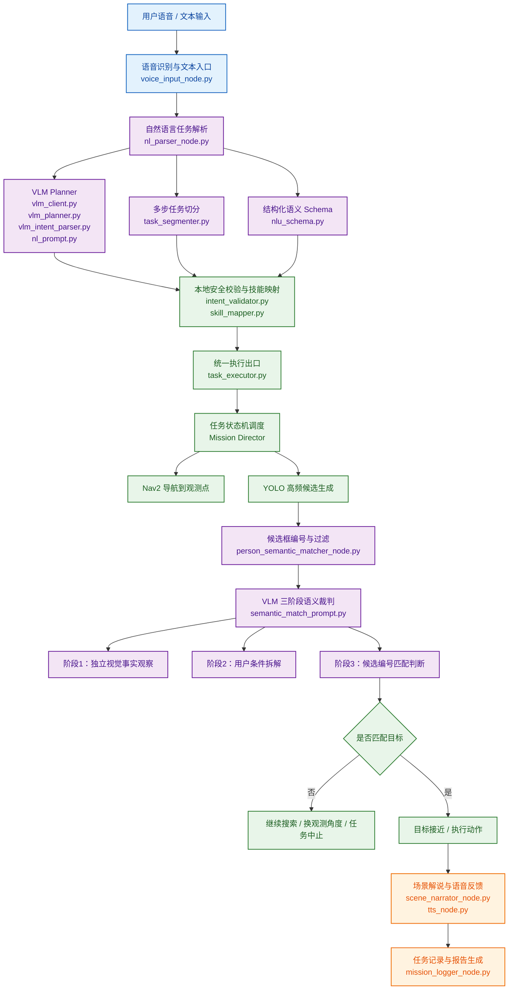

# 关键技术点3：端侧 VLM 驱动的自然语言具身任务规划与安全执行

本部分展示端侧 VLM 如何从单纯图文问答模块进入真实移动机器人任务闭环。系统不让 VLM 直接控制底盘，而是将其限定在自然语言理解、开放语义目标裁判和结果生成环节；机器人动作由本地技能映射、安全校验、任务状态机和 Nav2 导航链路执行。

## 核心思想

| 设计点 | 作用 |
|---|---|
| VLM 语义理解 | 将自然语言任务解析为结构化 intent / steps |
| YOLO 高频候选 | 持续生成可定位、可接近的目标候选框 |
| VLM 低频裁判 | 对颜色、姿态、手持物和空间关系等开放语义条件进行判断 |
| 本地安全执行 | 将模型输出约束到白名单技能、合法航点、可取消任务和 Nav2 执行链路 |
| 任务反馈闭环 | 通过语音播报、场景解说和报告生成记录任务过程 |

## 总体链路

## 文档

| 文档 | 内容 |
|---|---|
| [`docs/01_算法链路说明.md`](./docs/01_算法链路说明.md) | 说明自然语言任务解析、VLM 三阶段语义裁判和本地安全执行链路 |
| [`docs/02_关键源码索引.md`](./docs/02_关键源码索引.md) | 说明源码文件职责与核心链路 |

## 源码范围

本目录整理端侧语义理解、候选目标裁判、技能映射、安全执行、语音反馈和任务报告相关的核心实现，便于沿着源码查看自然语言任务进入机器人执行闭环的过程。
