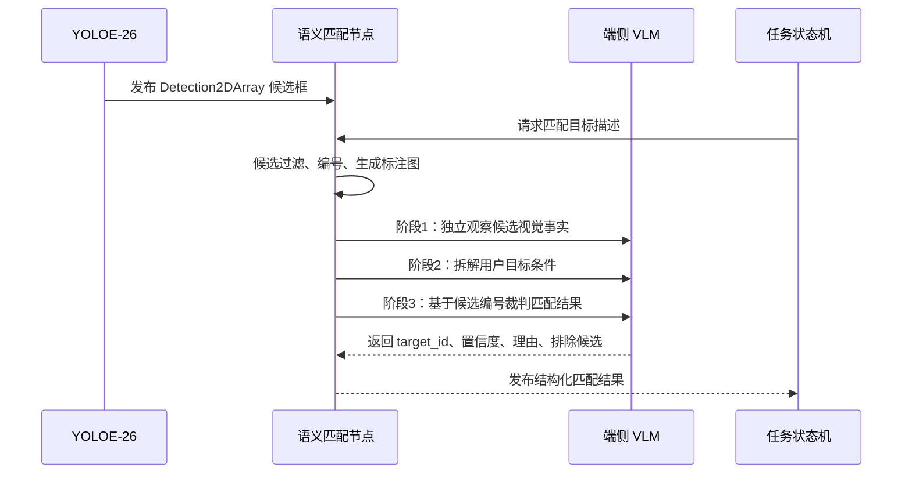
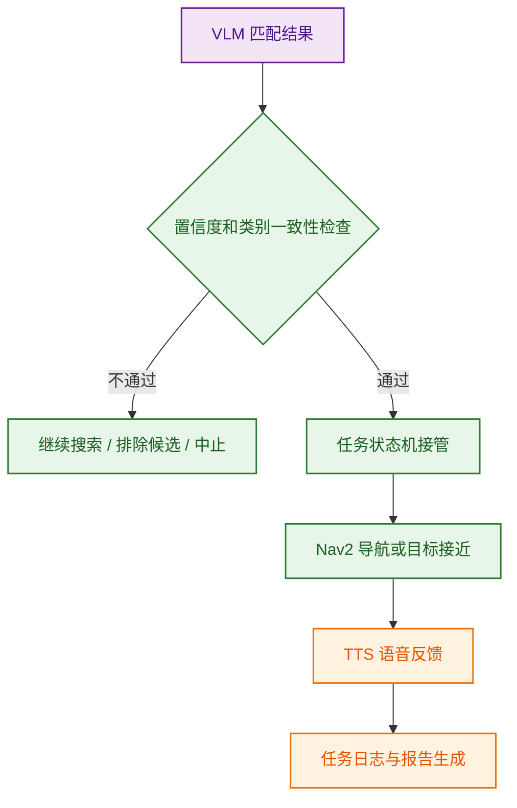

# 端侧 VLM 驱动的自然语言具身任务规划与安全执行链路

## 1. 设计定位

普通视觉语言模型通常输出文本描述或问答结果，不能直接代表机器人已经完成真实世界中的导航、搜索、接近和反馈。因此，本系统没有采用“VLM 直接控制底盘”的方式，而是将端侧 VLM 放在语义理解和目标裁判位置：VLM 负责理解用户意图、判断开放语义目标是否匹配；真实运动由本地技能映射、安全校验、Nav2 导航和任务状态机执行。

该设计的关键边界是：VLM 输出的是结构化语义结果和候选目标判断，不直接输出 `/cmd_vel`，也不直接决定底盘运动速度。

## 2. 自然语言到结构化任务

用户可以通过语音或文本输入自然语言任务。系统先将输入统一送入自然语言解析节点，再由端侧 VLM 生成结构化任务描述。

结构化中间层包括三类核心对象：

| 对象 | 含义 |
|---|---|
| `ParsedIntent` | VLM 对用户输入的总体理解结果 |
| `SemanticStep` | 单个语义阶段，例如导航、找人、语义找目标、归位、报告生成 |
| `StageAction` | 本地系统真正允许执行的动作单元 |

对于复合任务，系统采用保守切分策略，只在明确动作连接词处拆分，避免把“穿黑裤子、拿着箱子、坐着的人”这类目标描述误拆成多个动作。

## 3. 本地安全校验与技能映射

VLM 解析结果不会直接下发给机器人。系统在本地执行以下约束：

| 校验项 | 作用 |
|---|---|
| 任务类型白名单 | 只允许导航、找人、语义找目标、归位、巡检、报告等已定义技能 |
| 参数合法性 | 检查航点、目标类别、目标描述和交接物品是否完整 |
| 缺槽位处理 | 当缺少必要参数时触发澄清，不直接执行 |
| 取消优先级 | 停止、取消等指令前置处理，保证任务可中断 |
| 执行出口统一 | 所有任务经 `TaskExecutor` 下发，避免多个模块绕过安全链路 |

这一层的作用不是替代 VLM 理解，而是把模型输出限制在机器人可执行、可验证、可取消的技能空间内。

## 4. YOLO 高频候选与 VLM 低频语义裁判

开放语义目标查找采用“YOLO 高频候选生成 + VLM 低频语义裁判”的协同方式。

三阶段裁判将“看图事实”“用户条件”和“最终匹配”拆开处理：

| 阶段 | 输入 | 输出 | 目的 |
|---|---|---|---|
| 阶段1：独立视觉事实观察 | 带编号候选框图像、YOLO 候选列表 | 每个候选的颜色、姿态、手持物、邻近物体和关系 | 减少为了迎合用户目标而改写事实 |
| 阶段2：用户条件拆解 | 用户原始请求、目标类别、目标描述 | 原子视觉条件列表 | 明确哪些条件必须满足 |
| 阶段3：候选编号裁判 | 阶段1事实、阶段2条件、候选列表 | `match / target_id / confidence / reason` | 只在已检测候选中选择目标 |

通过候选框编号约束，机器人最终只能接近真实检测到的候选目标，降低 VLM 脱离画面生成目标的风险。

## 5. 安全执行与反馈闭环

当语义匹配成功后，任务状态机根据目标编号、目标类别、距离和任务阶段决定是否接近、继续搜索、换观测角度或中止任务。任务执行过程中的反馈由语音播报、场景解说和任务报告共同完成。

## 6. 工程特点

- 端侧运行：VLM 服务通过本地 HTTP 接口调用，减少对云端网络的依赖。
- 低频触发：VLM 只在自然语言解析、候选稳定、语义裁判和结果生成等关键事件触发。
- 候选约束：开放语义判断被限制在 YOLO 已检测候选中，保证目标可定位、可接近。
- 执行隔离：VLM 不直接发布速度指令，真实动作由本地任务状态机和 Nav2 执行。
- 可追溯反馈：任务过程可记录为结构化日志、关键帧和中文报告。
